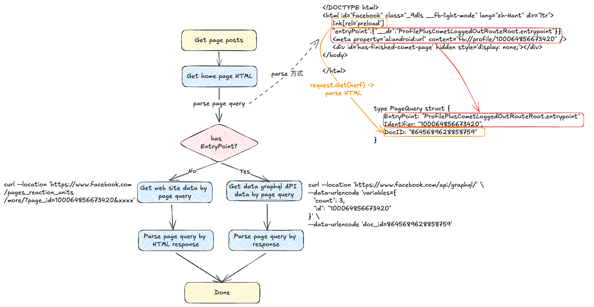

# facebook-crawler

## TODO

- [ ] Profile
- [ ] Post
  - [x] Page (graphql API POC 完成)
- [ ] Video
- [ ] Reals
- [ ] Comment

## Page Posts

流程:



使用方式(詳細如 [example](./example/)):

```go
// args
url := "https://www.facebook.com/anuetw/"
startDateStr := "2024-10-05"

startDate, err := time.Parse("2006-01-02", startDateStr)
if err != nil {
  panic(err)
}

// cerate repository
postFetcher := fetcher.NewFetcher(url)
formatter := formatter.NewFormatter()
parser := parser.NewParser()

// create use case
crawler := crawler.NewCrawler(postFetcher, formatter, parser)

// business logic
posts, err := crawler.FetchPagePosts(startDate, time.Now())
if err != nil {
  panic(err)
}
```

會回傳:

```json
[
  {
    "Name": "Anue鉅亨網財經新聞",
    "Message": "在近期開始出現各種陰謀論，加密貨幣將無牛市，或許從一些面向可以說牛市衰竭，但不可否認是加密貨幣仍然是今年表現最好的資產，是否會有再往上的機會，從多面向仍是利多，許多機構報告表示衰竭但從大戶動向、ETF表現看來還是持續四年牛市的週期，靜待十月啟動以及十一月選舉後的表現。\n\n📌加入鉅亨各種交流Line群\n▶️https://linktr.ee/yesverse\n\n📌加入鉅亨加密世界FB粉絲團，掌握最新動態▶️http://user11963.psee.io/42lnv9\n📌全台最大虛擬貨幣教育平台「鉅亨買幣」帶你輕鬆入幣圈，打造幣圈被動收益▶️https://pse.is/44um76\n📌鉅亨加密世界新上線🎉▶️https://sndn.link/anuecrypto",
    "PostURL": "https://www.facebook.com/anuetw/videos/1514783999406924/",
    "Cursor": "AQHRMIWiNpTZugKtXzOcVNEdtqQEs6WG5AHppY8HTAfPgKiqauIjlN0Bk3el8EMdmQWJsEw3TswSLHEP4xL3nFDJtHgpdlMbNp3ofymai1RULQ-SZ2BbtcmV_pz6aEFvFG1Q5oNmxW066Dk4SrtKtbGvWguvJ9554dZFzcrLuo7XsfH5Mj0i8DbpUMKuhBmQ2xxtJXgEIj1cH4khFAOnFtTJNBypE7leJ2UIPc3fHrpzA9eXIfnzWAZ8CSWfvECh7Zx2m3cvp9tokT-QAxHaDXya0VbrBTPrAg1FAwzSVuGdVDUEQM9eVAdL7GFTlZBuY2AgZDpVdrSHKsYADCLXTRmrAKnyomV_Kcv5gRpLopPfkbKpQM9jZ8tzLiD95i1lpBZ3rIqFaKPP5Fo302GbrFZBaOmFETilKRhtNihrEAxnJ29Ali4-2cMi_OmoKlFuEdwJd3lqds2BAyryIAyO5wY9a1O6CJMgN8CCTj9hz1djuxLIvz2cKcSzNTOAj0WIhnLk",
    "CreatedTime": "2024-10-08T16:33:29+08:00"
  },
  {
    "Name": "Anue鉅亨網財經新聞",
    "Message": "近期ETF商品掀起全民的投資熱潮！觀察過去10年全球ETF資產管理規模以跳躍式成長，累計成長率近600%，同期間全球共同基金僅成長約80%，顯示ETF已成為重要的資產配置理財工具之一。\n\n專家建議：追求穩定收益的投資人可布局全球型ETF，以更有效地降低單一市場的風險。\n\n立即了解如何布局\u003e\u003e\u003e",
    "PostURL": "https://www.facebook.com/anuetw/posts/pfbid0mWBdLioc2nko7hd8ockqFV8P8gqZ2AaA58rkEUygZja3qpZPLLf1Hjo3vhWp6F9yl",
    "Cursor": "AQHRIFJCPqdLQof43bAtJGgUCQAsoJUN4tq6Isu24JEXjEJbYzgDQ6n3fWqCYzx8Z2wBJR5kYUzVulf-O2zYEHd7X3IMDnObimu-tW8wMG-5zO0Y5bMRo7cAzvg5YppD8bWsHdlA6vl4l1KkYH4Jp8muiRbjk-Qc2PirXD_vXNny1qWOS6KH-VuDNdy-9OaJ931d1kAag-gaDbyEPOKi4LWI5vxpzer9ltUFHPh3dZ-01sWJGq82MBKlU15I6qdGH1U9Tyrf2tyK6j6Dal8F4877-O35JLmvo_m4tmjttEKMj9FxZBQMix-OJA5xceR43rokD6_chLJs57TfSDo4CZDw8_JEqOPeqh5RaClJ50UMZMNJ6zQH6dFeP0j9S8MX9rSkb2SFC0XQ5KrdvZwbGMTfGtY_r9BSq7Kgs-y9A53hy0tdXPabatMKXRtDTlTMQJgJ-g9K__e07Ev9ulnE7iJMCXI2-CccnHLSa_fGitUfP5Pn4TW6Rb94ftPO2Wj8X-ft",
    "CreatedTime": "2024-10-08T15:00:09+08:00"
  },
  {
    "Name": "Anue鉅亨網財經新聞",
    "Message": "第三季全球市場震盪起伏，擔憂美國經濟衰退與科技股負面消息一度衝擊市場，雖然震盪起伏，多數股市仍持續上揚，債市也受惠聯準會展開降息循環有不錯的表現。\n展望第四季，野村投信認為，美國經濟軟著陸機會高，加上聯準會採取預防性降息，有利於風險性資產的投資前景，股市短線雖可能受到美國總統大選之不確定因素干擾，但中長期展望持續正向，債市亦可持續受惠降息趨勢，因此，建議採股債均衡配置，股市以成長前景良好的美、台為主，債券以新興美元主權債與美國非投資等級債為主，投資等級債則看好美國及金融債。",
    "PostURL": "https://www.facebook.com/anuetw/posts/pfbid0Uq8PArzBUmc6QgmTR53qjEg5Abkooz74ERt47UbUak2zcRRBnLLuySw2YzG6mCavl",
    "Cursor": "AQHR3CHQLf7d4x_Kbol950Fw9ZncLPIQCwV2AfEOm3gPGoqOeH29e4PdkN8K3sa5nzZ6g0Z48e5Eb85ADCUGN7pcsnMr9WvtbIcbDl_mBQasW5C55rxYc0wSVt2T7tqzCP8zD35RhOlxViI67mle7Ovjw-8ZZSSZlH8HG7xpP6yWVfkdUcg0DX73fs3WchTpB9BuMX2D6OhevUUqw6t_dfGaAJ0z1dQEwIS-i7x2s6Z89BZ9E3RMYUwwFEhmGTxtlMpxz62Zu06wmC1yY7-txIpS9nUfkpbLg5imoABjiA1-0lmlVe8crDZ9YANnH3yAd9CBHyQ2m4N2QAs90tcj8EqZ_SSEtNE83YmDsBXzruhoDejfPlOCcnQwNtf0fgxEnuk9Zjz5aG7qo6EJFm6rP71Hl-folvOAk--CAHnuTLLzpVcvWcrXTp4J2hiRKsv-ysNB1dVdixAulFp79Rxuv5DwRuFxQzTw8Ba9aZN3RxY9_i8dmf1iXyw4TQqpuazcge3R",
    "CreatedTime": "2024-10-08T11:00:18+08:00"
  }
]
```
